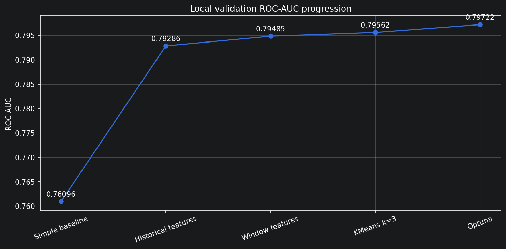
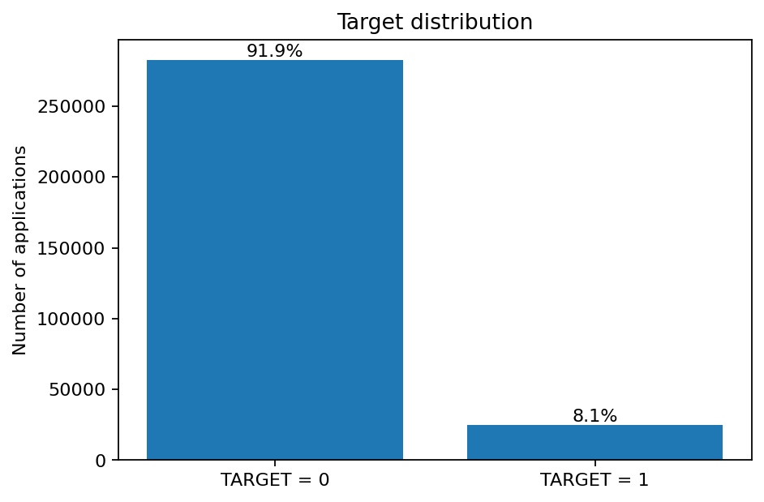
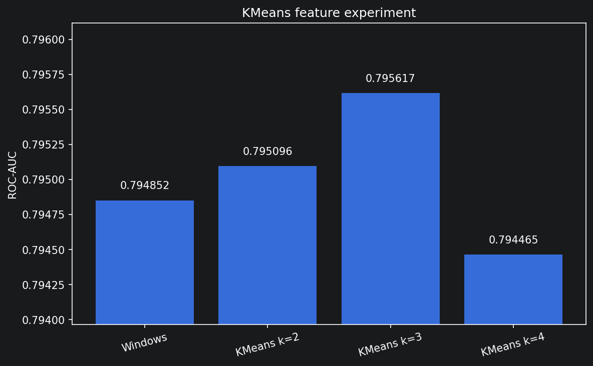
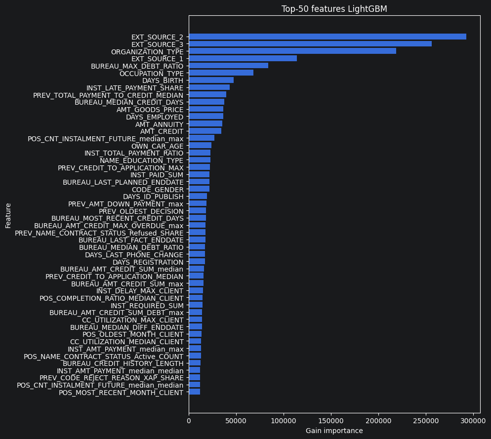

# Home Credit Default Risk

Проект по бинарной классификации для соревнования Kaggle **Home Credit Default Risk**.  
Задача — оценить вероятность того, что у клиента возникнут проблемы с погашением кредита.

В модели используются данные текущей заявки и кредитная история клиента: прошлые кредиты, предыдущие заявки, платежи, POS/Cash-кредиты и кредитные карты.

- **Модель:** LightGBM
- **Метрика:** ROC-AUC
- **Лучший ROC-AUC на holdout:** `0.79722`
- **Kaggle Public:** `0.79329`
- **Kaggle Private:** `0.79418`

Данные: https://www.kaggle.com/competitions/home-credit-default-risk/data

Основной упор в проекте сделан на работу с историческими таблицами и временными признаками, а не на ансамбль из нескольких моделей.

## Развитие качества модели



Самый большой прирост дало добавление признаков из кредитной истории. Временные окна, KMeans-признаки и настройка LightGBM дали дополнительные улучшения.

## Постановка задачи

`TARGET` — бинарная целевая переменная:

- `TARGET = 1` — у клиента были проблемы с выплатой кредита;
- `TARGET = 0` — кредит обслуживался без серьёзных проблем.

Модель предсказывает вероятность `TARGET = 1`.

Классы сильно несбалансированы: положительный класс составляет около 8%, поэтому основной метрикой используется ROC-AUC.


## Данные

В соревновании используются семь основных таблиц:

- `application_train.csv`, `application_test.csv` — текущая заявка;
- `bureau.csv` — кредиты клиента в других кредитных организациях;
- `bureau_balance.csv` — помесячная история кредитов из `bureau`;
- `previous_application.csv` — предыдущие заявки в Home Credit;
- `POS_CASH_balance.csv` — история POS/Cash-кредитов;
- `installments_payments.csv` — плановые и фактические платежи;
- `credit_card_balance.csv` — история кредитных карт.

`application_train` находится на уровне текущей заявки: одна строка соответствует одному `SK_ID_CURR`.

Исторические таблицы содержат несколько записей на одного клиента, поэтому перед объединением с основной таблицей они агрегируются до уровня `SK_ID_CURR`.

Для `bureau_balance` агрегация идёт в два шага:

```text
bureau_balance
    -> SK_ID_BUREAU
    -> bureau
    -> SK_ID_CURR
```

`POS_CASH_balance`, `installments_payments` и `credit_card_balance` уже содержат `SK_ID_CURR`, поэтому их можно агрегировать непосредственно на уровне клиента. `SK_ID_PREV` при этом используется для признаков на уровне конкретного предыдущего договора.

После агрегации перед merge проверяется уникальность `SK_ID_CURR`. Для объединений, где ожидается одна строка на клиента, используется `validate="one_to_one"`.

## Feature engineering

Основная часть проекта — преобразование истории клиента в признаки уровня `SK_ID_CURR`.

Подробное описание признаков вынесено в [`FEATURES_DESCRIPTION.md`](FEATURES_DESCRIPTION.md).

### Агрегаты по всей истории

Для числовых признаков рассчитываются статистики вроде:

```text
median
max
count
sum
```

Примеры:

```text
BUREAU_AMT_CREDIT_SUM_median
BUREAU_AMT_CREDIT_SUM_DEBT_max
PREV_AMT_CREDIT_median
```

Медиана описывает типичное поведение клиента, а максимум помогает сохранить информацию о редких, но важных экстремальных событиях.

Для категориальных признаков считаются количество и доля каждой категории:

```text
COUNT
SHARE
```

Например, два активных кредита могут означать совершенно разное:

```text
2 активных кредита из 2
2 активных кредита из 10
```

Поэтому используются и абсолютное количество, и доля.

### Производные признаки

Кроме обычных агрегатов, рассчитываются признаки с более понятным экономическим смыслом.

Для предыдущих заявок, например:

```text
CREDIT_TO_APPLICATION =
    AMT_CREDIT / AMT_APPLICATION

DOWN_PAYMENT_SHARE =
    AMT_DOWN_PAYMENT / AMT_APPLICATION

ESTIMATED_TOTAL_PAYMENT =
    AMT_ANNUITY * CNT_PAYMENT

TOTAL_PAYMENT_TO_CREDIT =
    ESTIMATED_TOTAL_PAYMENT / AMT_CREDIT
```

Для платежей дополнительно рассчитываются:

- задержка относительно плановой даты;
- число дней просрочки;
- факт и сумма недоплаты;
- отношение фактического платежа к требуемому;
- доля просроченных платежей;
- доля записей без фактической информации об оплате.

Для кредитных карт:

```text
CC_UTILIZATION =
    AMT_BALANCE / AMT_CREDIT_LIMIT_ACTUAL

CC_PAYMENT_TO_MIN =
    AMT_PAYMENT_CURRENT / AMT_INST_MIN_REGULARITY
```

## Временные признаки

Обычная агрегация по всей истории смешивает старые и недавние события. Для кредитного риска это не всегда удобно: недавнее ухудшение поведения может быть важнее событий нескольких летней давности.

Поэтому отдельно считаются признаки по недавней истории:

| Таблица | Окна |
|---|---|
| `bureau` | последние 3 / 5 / 10 кредитов |
| `bureau_balance` | последние 3 / 6 / 12 месяцев |
| `previous_application` | последние 3 / 5 / 10 заявок |
| `POS_CASH_balance` | последние 3 / 6 / 12 месяцев |
| `installments_payments` | последние 90 / 180 / 365 / 730 дней |
| `credit_card_balance` | последние 3 / 6 / 12 месяцев |

Пример:

```text
BUREAU_LAST_3_AMT_CREDIT_SUM_median
BUREAU_LAST_5_AMT_CREDIT_SUM_median
BUREAU_LAST_10_AMT_CREDIT_SUM_median
```

Для `bureau` дополнительно сохраняются характеристики самого свежего кредита.

## Trend-признаки

Временное окно показывает состояние клиента за конкретный период, но не показывает, меняется ли его поведение.

Для этого рассчитываются признаки вида:

```text
TREND = статистика короткого окна - статистика длинного окна
```

Примеры:

```text
BUREAU_TREND_3_10_...
BB_TREND_3M_12M_...
PREV_TREND_3_10_...
POS_TREND_3M_12M_...
INST_TREND_90D_365D_...
CC_TREND_3M_12M_...
```

Всего добавлено **86 trend-признаков**.

Это не коэффициент линейного тренда, а разность двух агрегатов. Такой вариант проще считать и интерпретировать на таблицах с разной длиной истории.

## KMeans как генератор признаков



KMeans используется только для создания дополнительных признаков, а не как финальный классификатор.

Для кластеризации берётся небольшой набор сильных числовых и категориальных признаков. В него входят `EXT_SOURCE_1/2/3`, характеристики кредитной истории, платежного поведения и социально-демографические признаки.

Перед KMeans:

- числовые пропуски заполняются медианой;
- категориальные пропуски — наиболее частым значением;
- категориальные признаки кодируются через One-Hot Encoding;
- числовые признаки стандартизируются;
- выбросы ограничиваются 1-м и 99-м процентилями, рассчитанными на train.

Проверялись `k=2`, `k=3` и `k=4`. Лучший downstream ROC-AUC LightGBM получился при `k=3`.

В итоговый набор добавляются четыре признака:

```text
KMEANS_3_CLUSTER
KMEANS_3_DISTANCE_0
KMEANS_3_DISTANCE_1
KMEANS_3_DISTANCE_2
```

Номер кластера передаётся в LightGBM как категориальный признак. Расстояния до центроидов остаются числовыми.

## Модель

Финальный классификатор — `LGBMClassifier`.

Для этой задачи LightGBM удобен тем, что хорошо работает с табличными данными, не требует масштабирования числовых признаков и умеет напрямую обрабатывать пропуски и категориальные признаки.

После feature engineering в processed-таблице:

- train: `307 511 × 1 250`;
- test: `48 744 × 1 249`.

Разница в одну колонку — `TARGET`, который есть только в train.

После удаления `TARGET` и `SK_ID_CURR` остаётся 1248 основных признаков. Ещё 4 KMeans-признака добавляются перед обучением, поэтому финальная модель получает **1252 признака**.

Лучшие параметры LightGBM:

```python
{
    "max_depth": 10,
    "num_leaves": 52,
    "learning_rate": 0.007190044679328283,
    "min_child_samples": 256,
    "min_split_gain": 0.908777719372033,
    "subsample": 0.8471397936075646,
    "colsample_bytree": 0.330897788373898,
    "reg_alpha": 2.8294914829092264,
    "reg_lambda": 1.8577840121344324,
    "class_weight": None,
    "n_estimators": 2845
}
```

## Валидация

Для основных сравнений используется один фиксированный stratified holdout:

```python
train_test_split(
    X,
    y,
    test_size=0.2,
    random_state=42,
    stratify=y
)
```

Это позволяет сравнивать изменения признаков на одном и том же разбиении.

Базовая версия модели дополнительно проверялась на 5-fold Stratified CV:

```text
Fold 1: 0.79299
Fold 2: 0.78874
Fold 3: 0.78424
Fold 4: 0.79139
Fold 5: 0.78940

Mean ROC-AUC: 0.78935
Std:          0.00297
```

Holdout оказался немного выше среднего CV, поэтому небольшие улучшения на нём нужно трактовать осторожно.

Kaggle test не используется для выбора параметров или preprocessing. Он нужен только для финального submission.

## История экспериментов

| Эксперимент | Local ROC-AUC | Kaggle Private | Kaggle Public |
|---|---:|---:|---:|
| LightGBM только на `application_train` | `0.76096` | `0.74227` | `0.74367` |
| Исторические признаки + настройка LightGBM | `0.79286` | `0.78556` | `0.78670` |
| 5-fold CV базовой версии | `0.78935 ± 0.00297` | — | — |
| + временные окна | `0.79485` | — | — |
| + KMeans, `k=2` | `0.79510` | — | — |
| + KMeans, `k=3` | `0.79562` | — | — |
| + KMeans, `k=4` | `0.79446` | — | — |
| + Optuna после windows + KMeans | **`0.79722`** | `0.79383` | `0.79284` |
| + installment trends | — | `0.79386` | **`0.79358`** |
| + trends всех таблиц | — | **`0.79418`** | `0.79329` |
| Повторная Optuna после trends | `0.79692` | — | — |

Самый большое изменение значения качества модели получилось после добавления признаков из исторических таблиц. После этого улучшения стали значительно меньше.

## Интерпретация модели

Для анализа использовались gain feature importance LightGBM и SHAP.

Среди сильных признаков:

- `EXT_SOURCE_2`;
- `EXT_SOURCE_3`;
- `ORGANIZATION_TYPE`;
- `EXT_SOURCE_1`;
- `BUREAU_MAX_DEBT_RATIO`;
- `OCCUPATION_TYPE`;
- `DAYS_BIRTH`;
- `INST_LATE_PAYMENT_SHARE`;
- признаки предыдущих заявок и долговой нагрузки.



Также проверялся отбор признаков по SHAP. Сокращённая версия модели получалась заметно компактнее, но не превысила полный набор по ROC-AUC, поэтому в финальной версии feature selection не использовался.

## Пропуски

Для LightGBM пропуски не заполняются глобально медианой или нулём. Модель умеет работать с `NaN` напрямую, а сам факт отсутствия значения иногда несёт полезный сигнал.

Отдельный preprocessing нужен только для алгоритмов, которые не умеют работать с `NaN`. В финальном pipeline это KMeans.

## Контроль leakage

Основные правила:

- `TARGET` не используется при построении признаков;
- `SK_ID_CURR` используется только как идентификатор;
- train и test не объединяются для расчёта preprocessing-статистик;
- imputer, scaler, quantile clipping и KMeans во время экспериментов fit только на train;
- validation используется только для оценки качества и early stopping;
- Kaggle test не используется для настройки модели;
- все сравниваемые версии модели проверяются на одном holdout.

После окончательного выбора pipeline KMeans и LightGBM переобучаются на полном размеченном train перед созданием submission.

## Работа с памятью

Проект разрабатывался локально на машине с 16 ГБ оперативной памяти, поэтому обработка больших исторических таблиц делалась поэтапно.

Использовались:

- `float32` вместо `float64`, где это возможно;
- чтение больших CSV частями;
- удаление временных DataFrame после использования;
- `gc.collect()`;
- cache готовых агрегатов по историческим таблицам;
- обработка больших таблиц по одной.

## Структура проекта

```text
home-credit-default-risk/
│
├── data/
│   ├── raw/                         # исходные данные Kaggle, не хранятся в Git
│   └── processed/                   # локальные обработанные данные
│
├── notebooks/
│   ├── 01_data_overview.ipynb
│   ├── 02_simple_baseline.ipynb
│   ├── 03_feature_engineering.ipynb
│   ├── 04_model_tuning.ipynb
│   └── 05_final_submission.ipynb
│
├── reports/
│   └── figures/
│
├── src/
│
├── FEATURES_DESCRIPTION.md
├── PROJECT_DEFENSE.md
├── README.md
└── requirements.txt
```

`src/` пока используется как заготовка под вынос переиспользуемого кода из ноутбуков; основная реализация проекта находится в `notebooks/`.

## Ноутбуки

### `01_data_overview.ipynb`

EDA: структура данных, распределение `TARGET`, пропуски, типы признаков и связи между таблицами.

### `02_simple_baseline.ipynb`

Простой LightGBM только на `application_train`. Используется как исходная точка до feature engineering исторических таблиц.

### `03_feature_engineering.ipynb`

Основной технический ноутбук проекта: агрегаты, производные признаки, временные окна и trends.

### `04_model_tuning.ipynb`

Сравнение версий модели, feature importance, SHAP, Optuna и эксперименты с KMeans.

### `05_final_submission.ipynb`

Финальная подготовка train/test, обучение KMeans и LightGBM на полном train и создание submission.

## Как запустить

1. Клонировать репозиторий:

```bash
git clone https://github.com/USL99/home-credit-default-risk.git
cd home-credit-default-risk
```

2. Создать окружение и установить зависимости:

```bash
python -m venv .venv
source .venv/bin/activate
pip install -r requirements.txt
```

3. Скачать данные соревнования Kaggle и положить CSV в:

```text
data/raw/home-credit-default-risk/
```

4. Запускать ноутбуки по порядку:

```text
01_data_overview.ipynb
02_simple_baseline.ipynb
03_feature_engineering.ipynb
04_model_tuning.ipynb
05_final_submission.ipynb
```

`03_feature_engineering.ipynb` обрабатывает самые большие таблицы и поэтому выполняется дольше остальных. Для повторных запусков используются сохранённые локально cache-файлы.

## Что получилось

В проекте удалось пройти от простого LightGBM на одной таблице до модели, использующей полную историю клиента.

Что дало наибольший эффект:

1. агрегаты из исторических таблиц;
2. признаки недавнего поведения;
3. KMeans-признаки;
4. повторная настройка LightGBM после изменения набора признаков.

После добавления trends дальнейшая Optuna уже не улучшила лучший local score. На этом я остановила эксперименты с текущей моделью.

## Что можно попробовать дальше

Если продолжать проект, я бы в первую очередь проверила:

- отдельные агрегаты для active / closed кредитов в `bureau`;
- более строгий feature selection на нескольких folds;
- slope-признаки по времени;
- adversarial validation train/test;
- CatBoost / XGBoost;
- ансамбль нескольких моделей.

## Стек

Python, pandas, NumPy, scikit-learn, LightGBM, Optuna, SHAP, Matplotlib, Jupyter, Git.